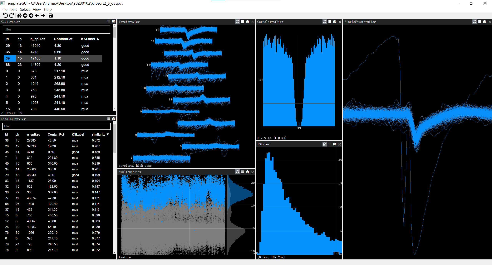
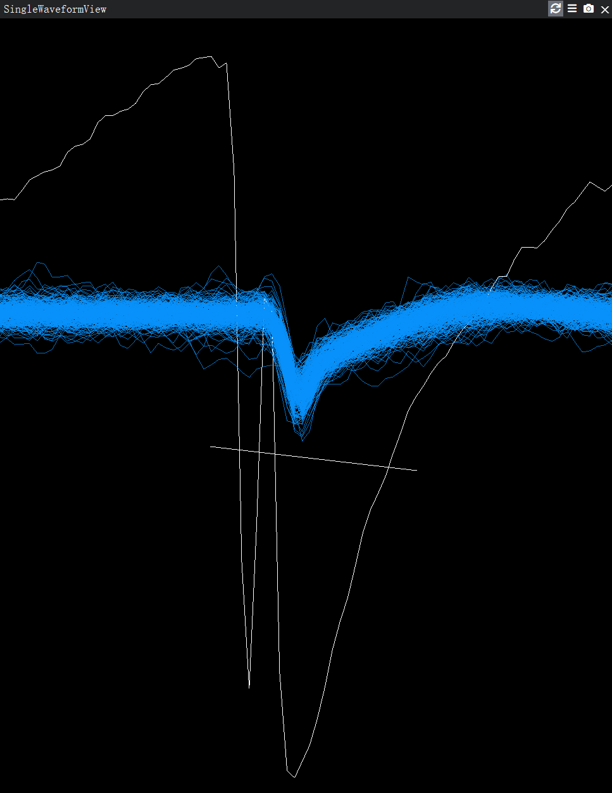
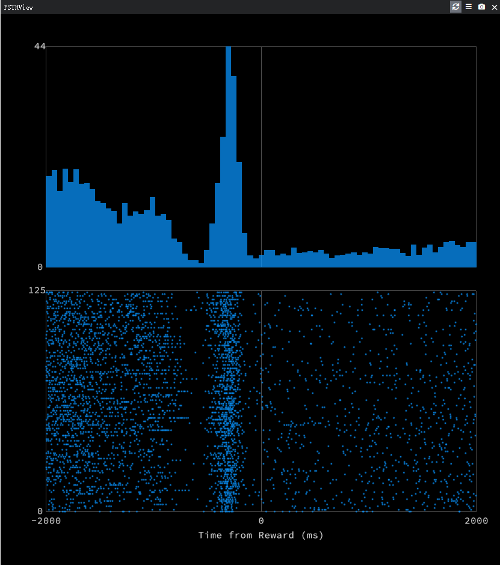

# Phy Waveform Plugin: remove strange waveforms in [phy](https://github.com/cortex-lab/phy)

## How to use it  
1. Download the plugin files `SettingsPlugin.py` and `WaveformPlugin.py` on the GitHub repository. 
2. Install `pandas` and `neo`.  

```
conda activate phy
pip install pandas
pip install neo
```  

3. Edit `C:/Users/UserName/.phy/phy_config.py`(create one if you do not have the directory `C:/Users/UserName/.phy`), and specify the plugin names to load in the GUI:  
```python
from phy import IPlugin

c = get_config()
c.TemplateGUI.plugins = ['SingleWaveformViewPlugin', 'SettingsPlugin', 'PSTHViewPlugin', 'CorrelationViewPlugin', 'SimilarityViewPlugin']  # list of plugin names to load in the TemplateGUI
c.Plugins.dirs = [r'C:\Users\jiumao\.phy\plugins'] # the directory where the plugins are located
```
4. Open phy. The plugins will be loaded automatically.

### Single Waveform View

* Click Menubar -> View -> Add SingleWaveformView
* `Ctrl + Left Click` the waveform in `WaveformView` to select the channel
* `Ctrl + Click` to select the waveforms that intersect with the line you draw  
*Note*: `split` action will be faster with shorter line.  

* Press `k` to split clusters or press `s` to split clusters and label the minor cluster as `noise`.  

### PSTH View

* Click Menubar -> View -> Add PSTHView
* Click the menu bar to set the events, t_pre, t_post and bin width.
*Note*: This plugin is only for certain BlackRock recordings.

### Correlation View
* The correlation between clusters. High correlation implys that one of the two clusters is misclassified by Kilosort and should be removed.
* Click Menubar -> View -> Add CorrelationView
* Click the menu bar to set the events, t_pre, t_post and bin width.
* `Ctrl + Click` to select the point and the corresponding clusters will be selected in `ClusterView`.

### Similarity View
* The similarity between clusters. High similarity implys that the two clusters are similar and should be merged.
* Click Menubar -> View -> Add SimilarityMatrixView
* Click the menu bar to set the point size and types of similarity. Similarity of waveform / autocorrelogram / inter-spike interval is supported.
* Click `Change dim` in the menu would change the dimension of the view. Dimension 2 would generate the scatter plot of the two types of similarity from all pairs of good and mua clusters.
* `Ctrl + Click` to select the point and the corresponding clusters will be selected in `ClusterView`.

#### How to use PSTH View for any recordings?  
* You should create `events.csv` and `event_labels.csv` in the data directory.  
* The event times should match to spike times.

| Filename | Notes |
| :------------- | :------------ |
|events.csv      |Each row is the timings of events|
|event_labels.csv|Each element is the name of that event|

## New shortcuts
* **s**: split clusters in `SingleWaveformView.py` and label the minor output cluster as `noise`. `Undo` twice undo this action. Firstly `undo` the labelling process and secondly `undo` the splitting process.
* **-**: defined in the `SettingsPlugin.py`. Apply the filter `ContamPct > 150`.
* Alias **ch**: defined in the `SingleWaveformView.py`. Select the channel id in SingleWaveformView. It is useful when the channel of interest is not displayed in WaveformView.
* Alias **good**: defined in the `SettingsPlugin.py`. Filter good clusters.
* Alias **mua**: defined in the `SettingsPlugin.py`. Filter mua clusters.
* Alias **noise**: defined in the `SettingsPlugin.py`. Filter noise clusters.
* Alias **goodmua** or **muagood**: defined in the `SettingsPlugin.py`. Filter mua and good clusters.
* Alias **e**: defined in the `PSTHView.py`. Change to the next event in PSTHView.

## About the plugins
* `WaveformPlugin.py`: defines the `SingleWaveformView`.
* `SettingsPlugin.py`: changes the columns in `ClusterView` and adds shortcut `-`.
* `PSTHPlugin.py`: defines the `PSTHView`.
* `CorrelationPlugin.py`: defines the `CorrelationView`.
* `SimilarityPlugin.py`: defines the `SimilarityMatrixView`.

## References
* [Customization in Phy](https://github.com/cortex-lab/phy/blob/master/docs/customization.md)
* [Phy Plugins](https://github.com/cortex-lab/phy/blob/master/docs/plugins.md)